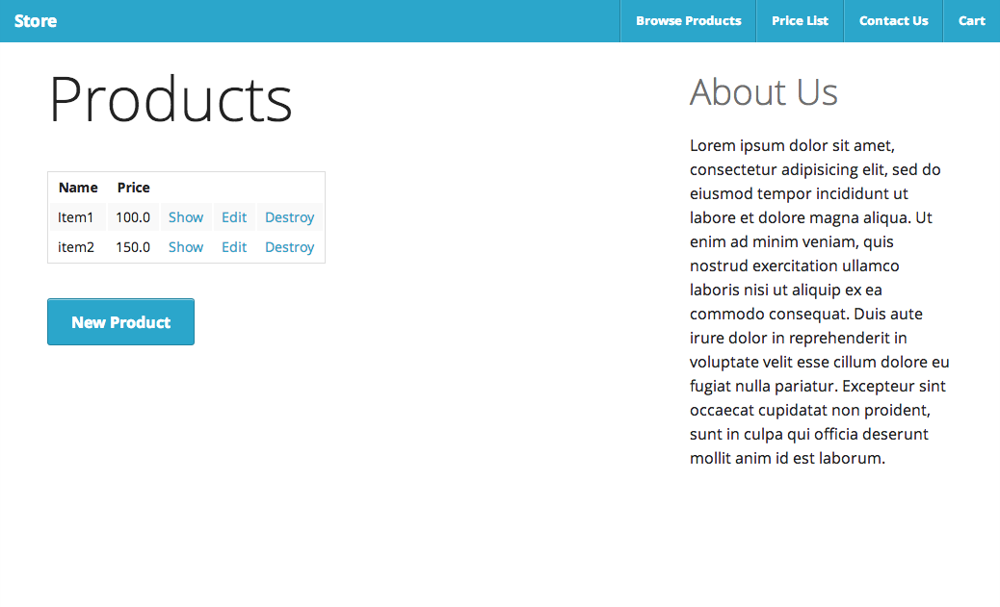

# Foundation

By [Phil Worthington](https://github.com/philworthington).

## Description
A product store made in Rails using Foundation for styling and structure using a 12 column grid system.

In Gemfile:
gem 'zurb-foundation'

Terminal:
rails g foundation:install

## Information

## Authors

* Phil Worthington (https://github.com/philworthington)
Based on Railscast #417 by Ryan Bates

## License

MIT: http://philworthington.mit-license.org
